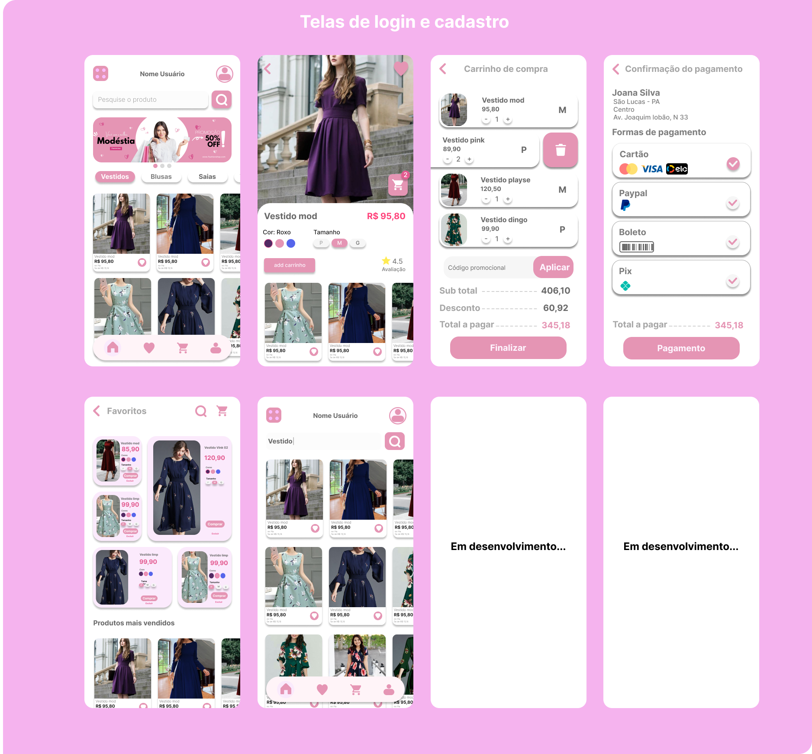
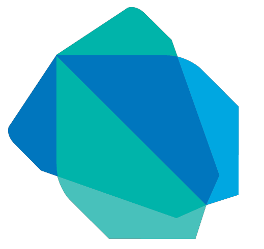
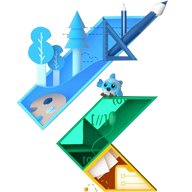

# Modéstia shop

## Descrição do projeto
**Modéstia shop** é uma loja virtual voltado para o público feminino trazendo vários modelos de roupas modestas para uso em diversas ocasiões.

## Índice 

* [Modéstia shop](#Modéstia-shop)
* [Índice](#índice)
* [Descrição do Projeto](#descrição-do-projeto)
* [Status do Projeto](#status-do-Projeto)
* [Tecnologias utilizadas](#tecnologias-utilizadas)
* [Desenvolvedor do projeto](#desenvolvedor-do-projeto)
## Descrição do Projeto
Este projeto tem como finalidade colocar em prática todo o meu conhecimento na linguagem Dart e framework flutter.

## Telas de login

Nas telas de login o usuário poderá fazer login ou se cadastrar preenchendo os campos disponíveis dentro do app ou pode fazer o cadastro com uma conta já existente da **google**, **facebook** ou do **x** (antigo Twitter).

## Corpo do app

## Status do projeto
> Todas as telas de login já foram construidas
>> Tela de login :white_check_mark:
>> Tela de cadastro :white_check_mark:
>> Tela de cadastro atravez das redes sociais :white_check_mark:

## Tecnologias utilizadas

## Desenvolvedor do projeto
| [ Fabricio Cintra](https://github.com/Anfacibry)
| --- |

